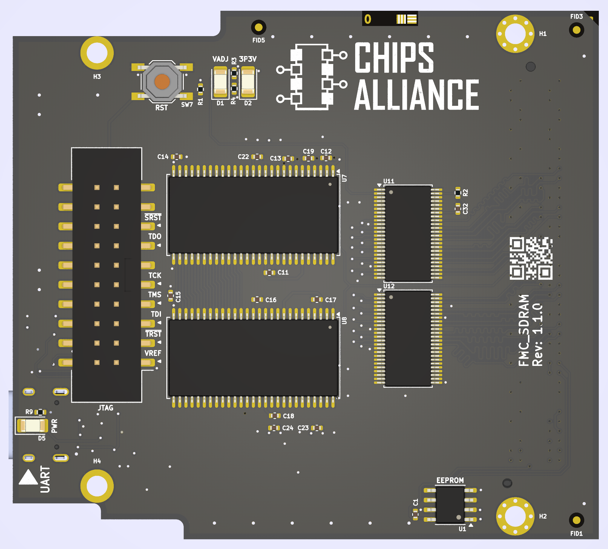
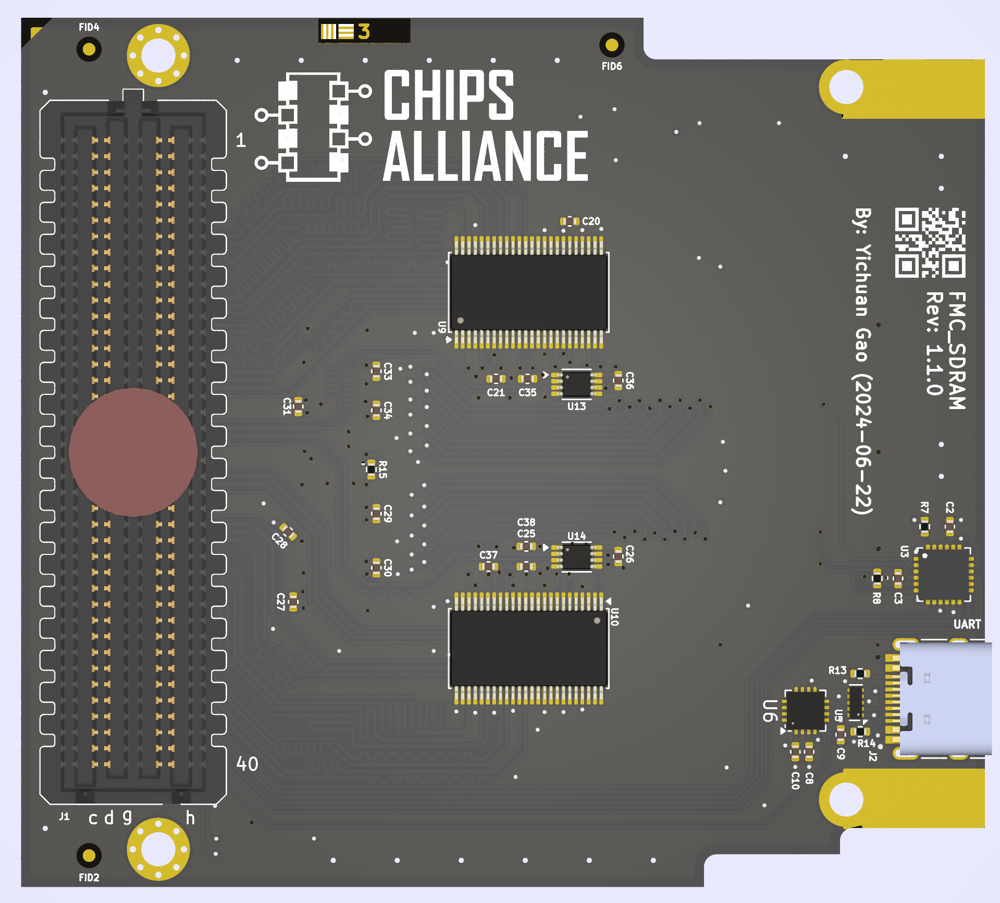

# FMC_SDRAM

FMC mezannine card with dual MT48LC16M16A2 SDRAM, organized as 16Mx32bit, with level shifters for VADJ.
Also includes USB to UART bridge, JTAG level shifter with ARM 20-pin JTAG header.





## Preparation

Install kicad 8, cmake, ninja, frugy.

## Precautions

When using it for the first time, it is necessary to program the IPMI FRU data
for the EEPROM so that the development board can identify the power supply
of the FMC.

## Build

```bash
cmake -G Ninja -B build
cmake --build build
```

If you only need to build the eeprom binary,

```bash
cmake --build build --target eeprom
```

If you only need to generate a pdf of the schematic or pcb,

```bash
cmake --build build --target pdf
```

If you need to generate complete production data,

```bash
cmake --build build --target production
```
