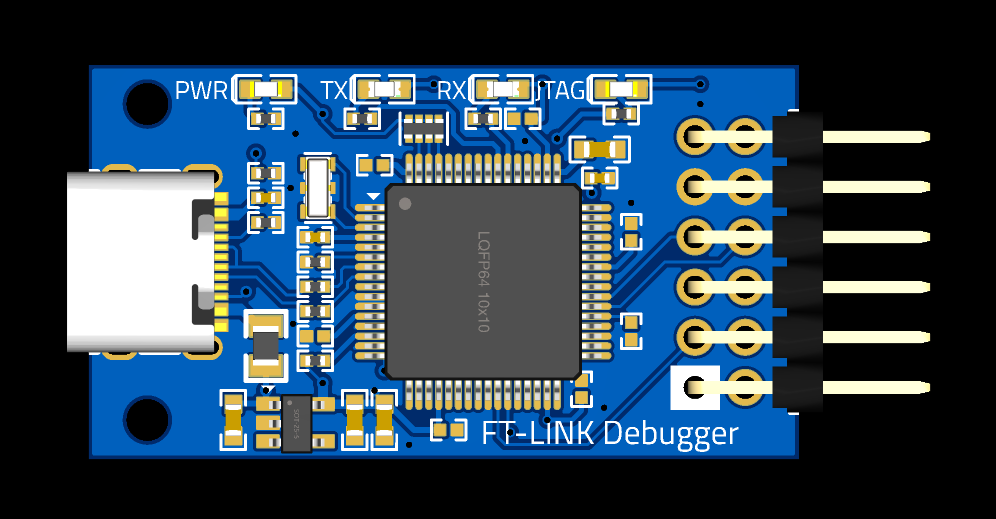

# FT-LINK

The FT-LINK is a generic in-circuit debugger and programmer based on the FT2232H chip. It supports both Joint Test Action Group (JTAG) and Universal Asynchronous Receiver/Transmitter (UART) interfaces. The FT-LINK connects to the host computer through a USB Type-C port, enabling seamless communication with any rocket-chip based FPGA designs.

## Overview

### PMOD Connector

This design complies with [Digilent Pmod™ Interface Specification 1.2.0](https://digilent.com/reference/_media/reference/pmod/pmod-interface-specification-1_2_0.pdf).

| PMOD Pin # | Digital Pin # | Pin Name |
| ---------- | ------------- | -------- |
| 1          | 0             | TDO      |
| 2          | 1             | nTRST    |
| 3          | 2             | TCK      |
| 4          | 3             | TXD      |
| 5          | NA            | GND      |
| 6          | NA            | 3V3      |
| 7          | 4             | TDI      |
| 8          | 5             | TMS      |
| 9          | 6             | nSRST    |
| 10         | 7             | RXD      |
| 11         | NA            | GND      |
| 12         | NA            | 3V3      |

### LED

| LED | Color | Description      |
| --- | ----- | ---------------- |
| 1   | Red   | Power            |
| 2   | White | UART TX Activity |
| 3   | White | UART RX Activity |
| 4   | Blue  | JTAG Status      |

## 3D View

### Top View

### Bottom View

