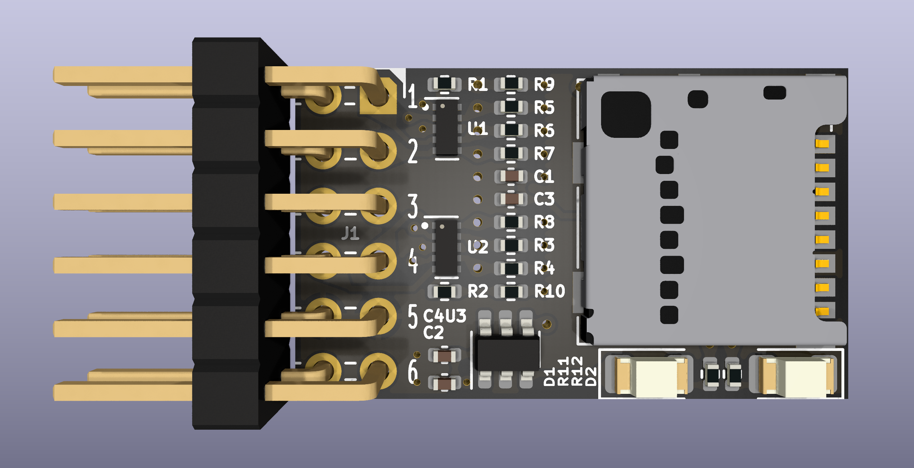
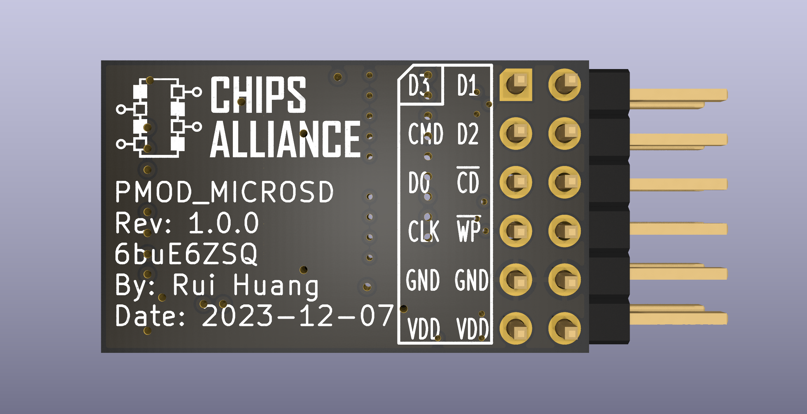

# PMOD_MICROSD

The Pmod MicroSD provides a microSD card slot to any board that has 3.3V logic
and is pin compatible with a 12-pin Pmod port capable of SPI communication.

This board is specially designed to adapt to VCU118, and the pull-up resistor
for SDIO is modified to 330 ohm.

## 3D view

### Top view



### Bottom view



## Introduction

### PMOD

This design complies with [Digilent Pmod™ Interface Specification 1.2.0](https://digilent.com/reference/_media/reference/pmod/pmod-interface-specification-1_2_0.pdf).

Note that the pin sequence numbers on the digilent PMOD specification are
inconsistent with the PMOD pin sequence numbers of AMD VCU118 on the document.
Essentially they are the same, but the numbering of AMD VCU118 uses a
double-column staggered odd-even arrangement.
Here is their mapping relationship.

| PMOD PIN | VCU118 PIN | SDIO FUNCTION | SPI FUNCTION |
| -------- | ---------- | ------------- | ------------ |
| 1        | 1          | DAT3(D3)      | #CS          |
| 2        | 3          | CMD           | MOSI         |
| 3        | 5          | DAT0(D0)      | MISO         |
| 4        | 7          | CLK           | SCLK(SCK)    |
| 5        | 9          | GND           | GND          |
| 6        | 11         | 3P3V(VDD)     | 3P3V(VDD)    |
| 7        | 2          | DAT1(D1)      | NC           |
| 8        | 4          | DAT2(D2)      | NC           |
| 9        | 6          | #DET(#CD)     | #DET(#CD)    |
| 10       | 8          | #WP           | #WP          |
| 11       | 10         | GND           | GND          |
| 12       | 12         | 3P3V(VDD)     | 3P3V(VDD)    |

### LED

There are two LEDs on the PCB, the yellow one is the card detection indicator
and the orange one is the power indicator.

| LED | COLOR  |         FUNCTION         |          ON           |       OFF       |
| --- | ------ | ------------------------ | --------------------- | --------------- |
| 1   | Yellow | Card detection indicator | MicroSD Card inserted | No MicroSD card |
| 2   | Orange | Power indicator          | Power on              | Power off       |

### Special signal

Among them, the ``#WP`` signal is constant high level. If the ``WP`` signal is
low, please check the power supply and there may be a fault.

|   NAME    |         HIGH         |           LOW            |
| --------- | -------------------- | ------------------------ |
| #DET(#CD) | No MicroSD card      | MicroSD Card inserted    |
| #WP       | Write protect is off | This state is impossible |

## Preparation

Install kicad 8, cmake, ninja.

## Build

```bash
cmake -G Ninja -B build
cmake --build build
```

If you only need to generate a pdf of the schematic or pcb,

```bash
cmake --build build --target pdf
```

If you need to generate complete production data,

```bash
cmake --build build --target production
```
